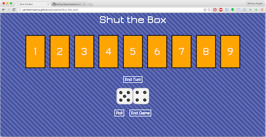
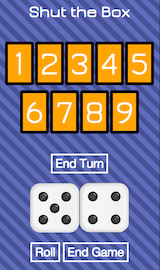

#Shut the Box
 

This is my interpretation of a game called SHUT THE BOX. If you've never heard of it before head on over to Wikipedia for more information [info](https://en.wikipedia.org/wiki/Shut_the_Box)
I have decided to show my process of creation from the beginning to the end of the process

To play the game click here: [PLAY SHUT THE BOX](http://yamikamisama.github.io/projects/shut_the_box/)

####Version 1 - Basic

This is simple HTML, CSS, and JS.  This iteration was simply to get the game up and running, basically the tinker stage.  The Javascript is a series of event listeners that create interactive an UI.  I thought about using Alerts for communication, but decided against that (mostly a design choice) and went with 
s that display different messages to the user.

My Thoughts: overall fun first iteration, needs to be refactored and should be modularized.

####Version 2 - Module

Refactored to be a Module/Plugin that you can include into your code to add the game on any page, simply:

Add the stylesheet to your head

`<link rel="stylesheet" type="text/css" href="css/main.css">`

Include the div anchor where you want it to show up on your page

`

`

Add the module after your jQuery lib (yes this does have a dependency on jQuery)

``

My Thoughts: Easier to read and understand the code, better use of single responsiblity functions, and Mobile Responsive.

####Version 3 - React (coming soon)

This version will be built using react components, and setState to control the state of the game.
